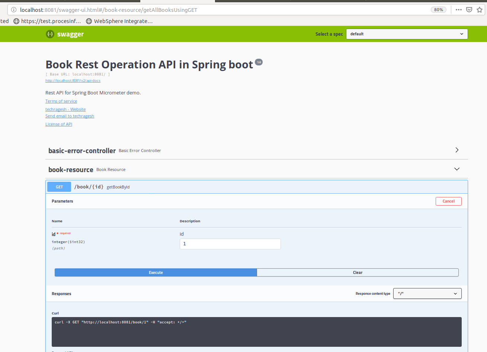
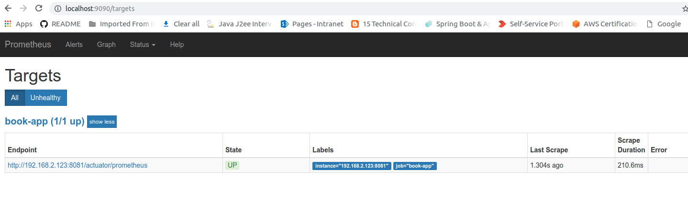
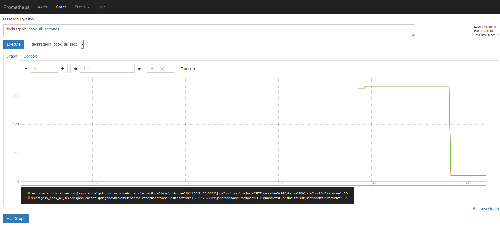
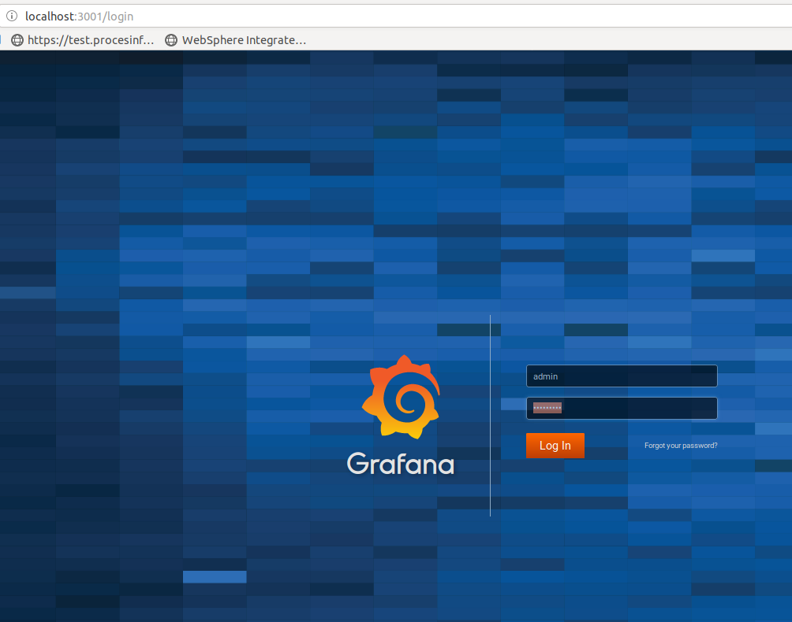
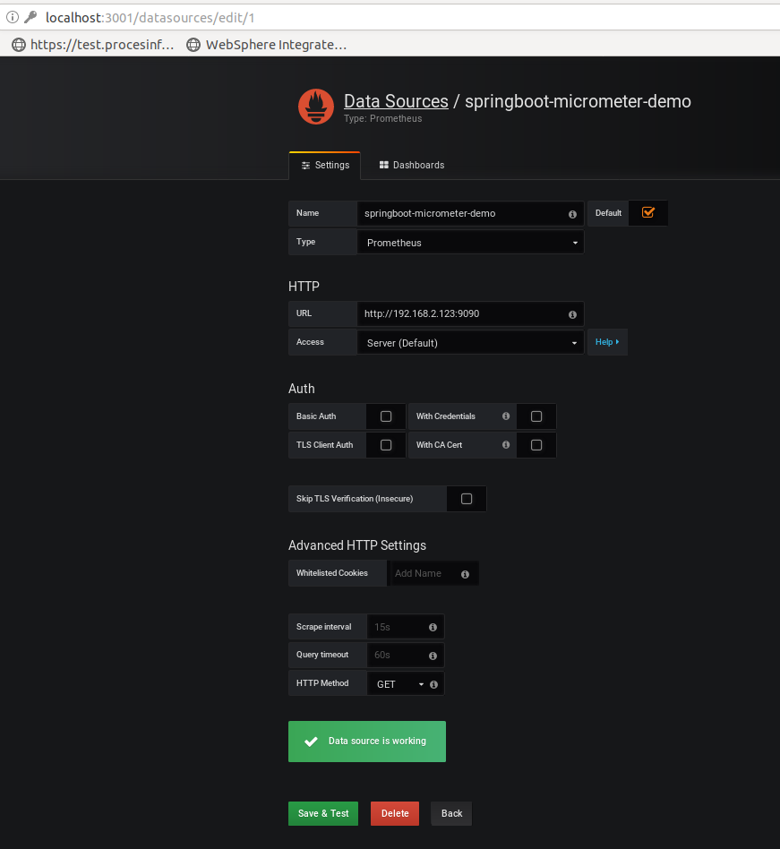
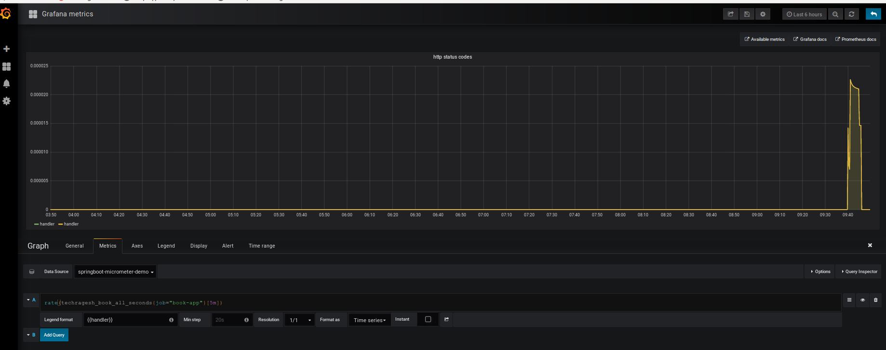

## springboot-micrometer-demo
This project shows how to use micrometer in springboot

## Micrometer 

> Micrometer provides a simple facade over the instrumentation clients for the most popular monitoring systems, allowing you to instrument your JVM-based application code without vendor lock-in. Think SLF4J, but for metrics.

> Starting with Spring Boot 2.0, Micrometer is the instrumentation library powering the delivery of application metrics from Spring. Support is ported back to Boot 1.x through an additional library dependency.
**(Refer https://micrometer.io/)**

## Prometheus

> Prometheus is an open-source systems monitoring and alerting toolkit originally built at SoundCloud.

**Features are**
* a multi-dimensional data model with time series data identified by metric name and key/value pairs
* a flexible query language to leverage this dimensionality
* no reliance on distributed storage; single server nodes are autonomous
* time series collection happens via a pull model over HTTP
* pushing time series is supported via an intermediary gateway
* targets are discovered via service discovery or static configuration
* multiple modes of graphing and dashboarding support

**(Refer https://prometheus.io/)**

**Docker Command:**
```
docker pull prom/prometheus

```

## Grafana

> Grafana is an open platform for beautiful analytics and monitoring. The leading open source software for time series analytics. o matter where your data is, or what kind of database it lives in, you can bring it together with Grafana. Beautifully.

**(Refer https://grafana.com/)**

**Docker Command:**
```
docker pull grafana/grafana

```

## Application Demo

Its a simple rest application. I have used **prometheus** and **grafana** for this **springboot micrometer** application.

Also I have used **swagger**, **lombok** and **mapstruct** dependencies.

Let me explain some key points while using this.

**_Swagger:_**

All you know, **Swagger** takes the manual work out of API documentation, with a range of solutions for generating, visualizing, and maintaining API docs.

**Maven Dependencies**  

```
        <dependency>
            <groupId>io.springfox</groupId>
            <artifactId>springfox-swagger2</artifactId>
            <version>${springfox-version}</version>
            <exclusions>
                <exclusion>
                    <groupId>org.mapstruct</groupId>
                    <artifactId>mapstruct</artifactId>
                </exclusion>
            </exclusions>
        </dependency>
        <dependency>
            <groupId>io.springfox</groupId>
            <artifactId>springfox-swagger-ui</artifactId>
            <version>${springfox-version}</version>
        </dependency>
        
```
Note: I have excluded mapstruct because i used mapstruct explicitly

**_lombok_**

Lombok is a java library that automatically plugs into your editor and build tools, spicing up your java

**Maven Dependencies**

```
        <dependency>
            <groupId>org.projectlombok</groupId>
            <artifactId>lombok</artifactId>
            <optional>true</optional>
        </dependency>

```

**_MapStruct_**

MapStruct is a code generator that greatly simplifies the implementation of mappings between Java bean types based on a convention over configuration approach.

```
        <dependency>
            <groupId>org.mapstruct</groupId>
            <artifactId>mapstruct-jdk8</artifactId>
            <version>1.2.0.Final</version>
        </dependency>

        <dependency>
            <groupId>org.mapstruct</groupId>
            <artifactId>mapstruct-processor</artifactId>
            <version>1.2.0.Final</version>
            <scope>provided</scope>
        </dependency>
        
        <plugin>
             <groupId>org.apache.maven.plugins</groupId>
             <artifactId>maven-compiler-plugin</artifactId>
             <version>3.7.0</version>
                <configuration>
                   <source>1.8</source>
                   <target>1.8</target>
                   <annotationProcessorPaths>
                     <path>
                       <groupId>org.mapstruct</groupId>
                       <artifactId>mapstruct-processor</artifactId>
                       <version>1.2.0.Final</version>
                     </path>
                     <path>
                       <groupId>org.projectlombok</groupId>
                       <artifactId>lombok</artifactId>
                       <version>${lombok.version}</version>
                      </path>
                   </annotationProcessorPaths>
                </configuration>
         </plugin>
        

```
To make java bean mapping easy, I used mapstruct. I have used Book and BookEntity class. 

BookMapper.java

```
@Mapper(unmappedTargetPolicy = ReportingPolicy.IGNORE, componentModel="spring")
public interface BookMapper {

    @Mappings({
        @Mapping(source = "bookName", target = "name")
    })
    Book toBook(BookEntity bookEntity);

    @InheritInverseConfiguration
    BookEntity fromBook(Book book);
}

```


**_Micrometer_**

```
        <dependency>
            <groupId>io.micrometer</groupId>
            <artifactId>micrometer-core</artifactId>
        </dependency>
        <dependency>
            <groupId>io.micrometer</groupId>
            <artifactId>micrometer-registry-prometheus</artifactId>
        </dependency>

```

MicrometerConfig.java

```
@Configuration
public class MicrometerConfig {

    @Bean
    MeterRegistryCustomizer meterRegistryCustomizer(MeterRegistry meterRegistry) {
        return meterRegistry1 -> {
            meterRegistry.config()
                    .commonTags("application", "springboot-micrometer-demo");
        };
    }
}

```

Also @Timed annotation in each controller method to track the metrics

```
@Timed(
            value = "techragesh.book.all",
            histogram = true,
            percentiles = {0.95, 0.99},
            extraTags = {"version", "1.0"}
    )

```


**Output**:





**_Add this application into prometheus_**

1. Install prometheus image in docker.
2. Created book-app.yml file

```
#Global configurations
global:
  scrape_interval:     5s # Set the scrape interval to every 5 seconds.
  evaluation_interval: 5s # Evaluate rules every 5 seconds.

scrape_configs:
  - job_name: 'book-app'
    metrics_path: '/actuator/prometheus'
    static_configs:
      - targets: ['192.168.2.123:8081']

```
**Note:** We have to use **ip-addreess** instead of **localhost** in targets in yml file

3. Run this command in docker: 

```
docker run -d  -p 9090:9090 -v <path>/book-app.yml:/etc/prometheus/prometheus.yml prom/prometheus --config.file=/etc/prometheus/prometheus.yml

```
**Note**: <path> is your book-app.yml location







**_Add prometheus into grafana_**

1. Install grafana image in docker.
2. Run grafana from docker and create your login



3. Add prometheus datasource in grafana.



4. Add the query under metrics tab

```
rate(techragesh_book_all_seconds{job="book-app"}[5m])

```



### Happy Coding

